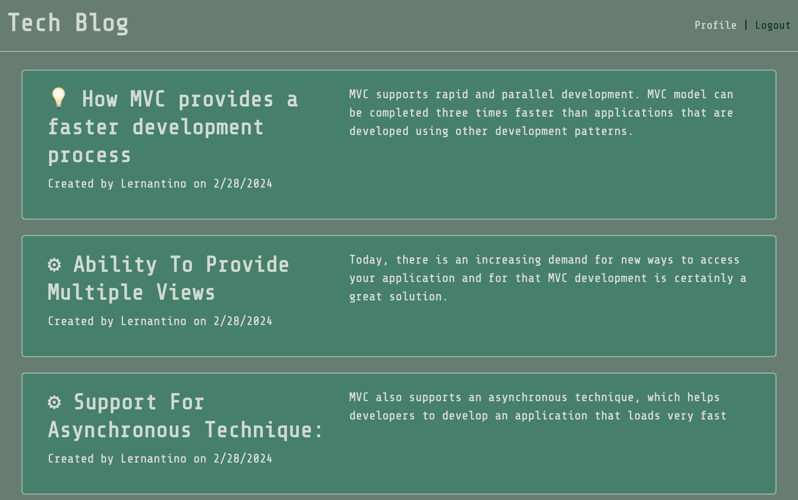
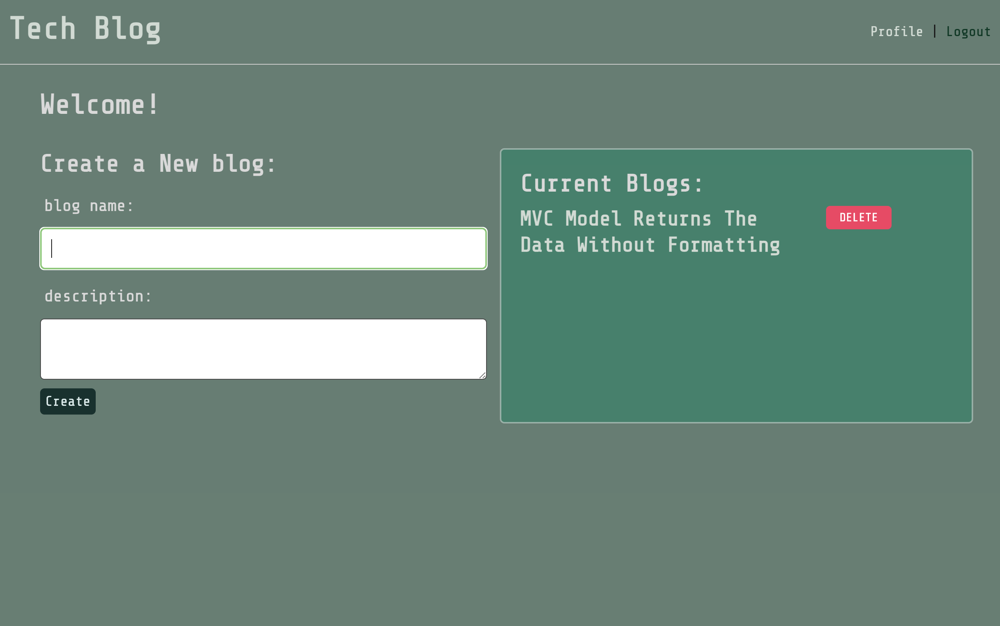
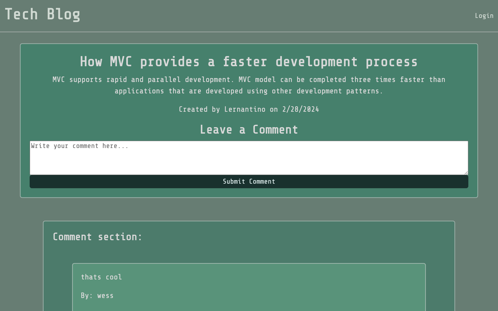

  # Blog Site 

  ## Description
  This is a blogcite dedicated to talk all things tech. Userews are able to inteact with one another and even learn from one another!

  ### Table of Contents 

  - [Installation](#installation)
  - [Usage](#usage)
  - [Credits](#credits)
  - [License](#license)
  - [Demo](#demo)
  - [Contact](#contact)

  ## Installation
  to install this application you can clone the repo: https://github.com/H3yJ4yy/Blog-Website

  ## Usage
  You will need to install the following dependacies:
  
    - bcrypt
    - dotenv
    - express
    - mysql2
    - sequelize

  ## License
  none 
 
  ## Demo
  
  
  

  ## Credits
  this was done with the help of my tutor
  
  ### Contact 
  For any further questions, feel free to contact me through my GitHub [H3yJ4yy](https://github.com/H3yJ4yy) or Email [agon0015@gmail.com](mailto:agon0015@gmail.com).
